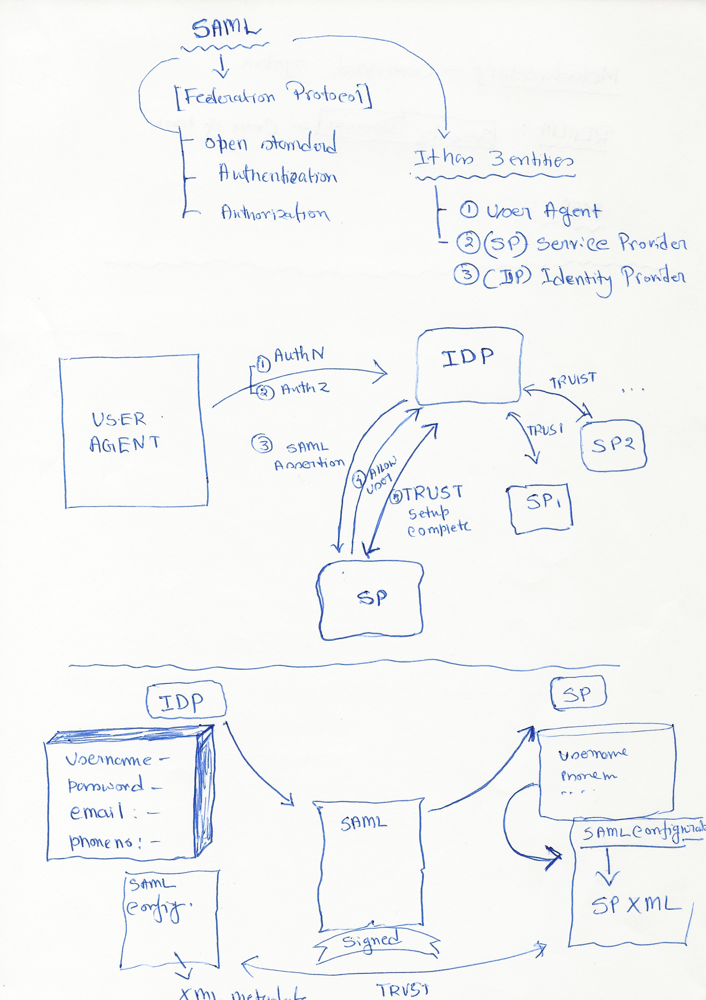

# Identity federation project for Spring Boot with SAML
Security Assertion Markup Language (SAML) is an XML-based open standard data format for exchanging authentication and authorization data between parties, in particular, between an identity provider and a service provider.

# Security Assertion Markup Language (SAML)
Security Assertion Markup Language (SAML) is an XML-based open standard data format for exchanging authentication and authorization data between parties, in particular, between an identity provider and a service provider.

### Generate keystore file:
    # Command to create self signed SSL Certificate JKS
    keytool -genkey -v -keystore springboot-saml-keystore.jks -alias springboot-saml -keyalg RSA -keysize 2048 -validity 10000
    
  - Password: secret  

This enable HTTPS in a Spring Boot Application. This will be using SSL Connection. Add the certificate to Keychain access.

### OKTA Configuration
* https://dev-46041526-admin.okta.com/admin/app/dev-46041526_springboothelloworld_1/instance/0oan8y2zqxE4Qv3cs5d6#tab-general

### Expected Logs:
    2021-04-25 11:50:28.672  INFO 69366 --- [nio-8443-exec-9] o.s.s.s.m.MetadataGeneratorFilter        : No default metadata configured, generating with default values, please pre-configure metadata for production use
    2021-04-25 11:50:28.717  INFO 69366 --- [nio-8443-exec-9] o.s.s.s.m.MetadataGeneratorFilter        : Created default metadata for system with entityID: https://localhost:8443/saml/metadata
    2021-04-25 11:50:29.854  INFO 69366 --- [nio-8443-exec-9] .s.m.p.AbstractReloadingMetadataProvider : New metadata succesfully loaded for 'https://dev-46041526.okta.com/app/exkn8y2zpNBaE6iRj5d6/sso/saml/metadata'
    2021-04-25 11:50:29.857  INFO 69366 --- [nio-8443-exec-9] .s.m.p.AbstractReloadingMetadataProvider : Next refresh cycle for metadata provider 'https://dev-46041526.okta.com/app/exkn8y2zpNBaE6iRj5d6/sso/saml/metadata' will occur on '2021-04-25T12:50:29.023Z' ('2021-04-25T14:50:29.023+02:00' local time)
    2021-04-25 11:50:29.974  INFO 69366 --- [nio-8443-exec-7] o.s.security.saml.log.SAMLDefaultLogger  : AuthNRequest;SUCCESS;0:0:0:0:0:0:0:1;https://localhost:8443/saml/metadata;http://www.okta.com/exkn8y2zpNBaE6iRj5d6;;;
    2021-04-25 11:50:30.098  INFO 69366 --- [nio-8443-exec-4] o.s.security.saml.log.SAMLDefaultLogger  : AuthNRequest;SUCCESS;0:0:0:0:0:0:0:1;https://localhost:8443/saml/metadata;http://www.okta.com/exkn8y2zpNBaE6iRj5d6;;;
    2021-04-25 11:50:54.050  INFO 69366 --- [nio-8443-exec-5] colMessageXMLSignatureSecurityPolicyRule : Validation of protocol message signature succeeded, message type: {urn:oasis:names:tc:SAML:2.0:protocol}Response
    2021-04-25 11:50:54.054  INFO 69366 --- [nio-8443-exec-5] o.s.security.saml.log.SAMLDefaultLogger  : AuthNResponse;SUCCESS;0:0:0:0:0:0:0:1;https://localhost:8443/saml/metadata;http://www.okta.com/exkn8y2zpNBaE6iRj5d6;riteshbangal@gmail.com;;
    2021-04-25 11:51:47.165  INFO 69366 --- [nio-8443-exec-7] o.s.security.saml.log.SAMLDefaultLogger  : AuthNRequest;SUCCESS;0:0:0:0:0:0:0:1;https://localhost:8443/saml/metadata;http://www.okta.com/exkn8y2zpNBaE6iRj5d6;;;

### References
* [SpringDeveloper | Demystifying SAML Using Spring Security](https://www.youtube.com/watch?v=PruyokKaJWw)
* [Spring Boot | SAML | OKTA](https://www.youtube.com/watch?v=YN2DOJttEaA)
* [Spring Boot with HTTPS Example | Tech Primers](https://www.youtube.com/watch?v=rm9OKTSm-4A)
* [Okta](https://developer.okta.com/) has been used an Identity Provider (IDP).
    This project has been implemented from [okta instructions](https://developer.okta.com/blog/2017/03/16/spring-boot-saml).
* [SAML-tracer](https://addons.mozilla.org/en-US/firefox/addon/saml-tracer/)
* [SAML Token - samltool.io](https://samltool.io/) - SAML Token Encoder
* [Web Toolkit Online | XML Formatter](https://www.webtoolkitonline.com/xml-formatter.html)