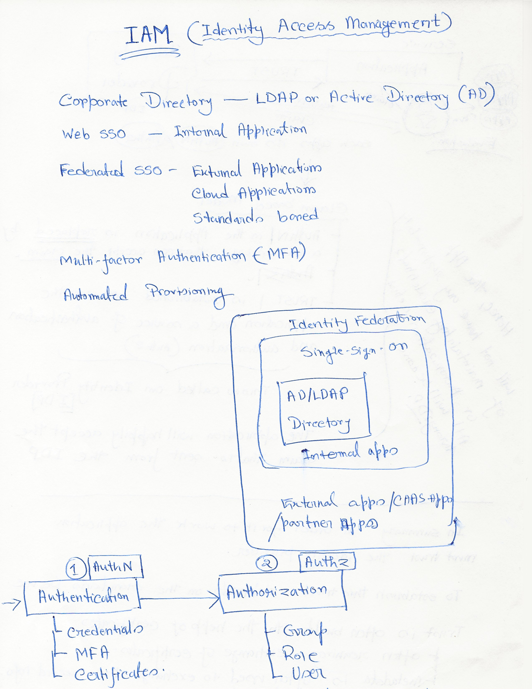
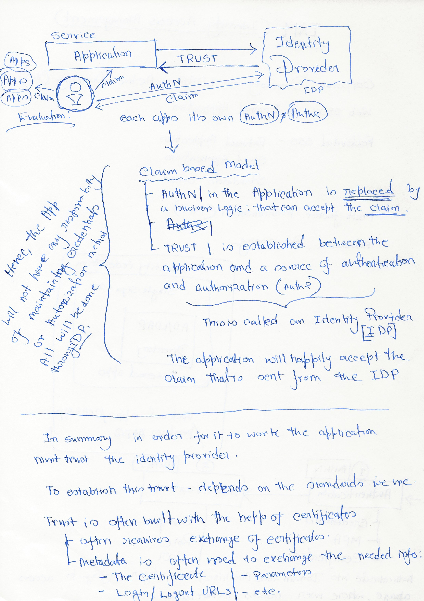

# Identity Federation
Identity Federation is the process of delegating an individual's or entity's authentication responsibility to a trusted external party. Each partner in federation plays the role of either an identity provider(IdP) or a service provider(SP)

### Reference 
* [SAML 2.0: Technical Overview](https://www.youtube.com/watch?v=SvppXbpv-5k)